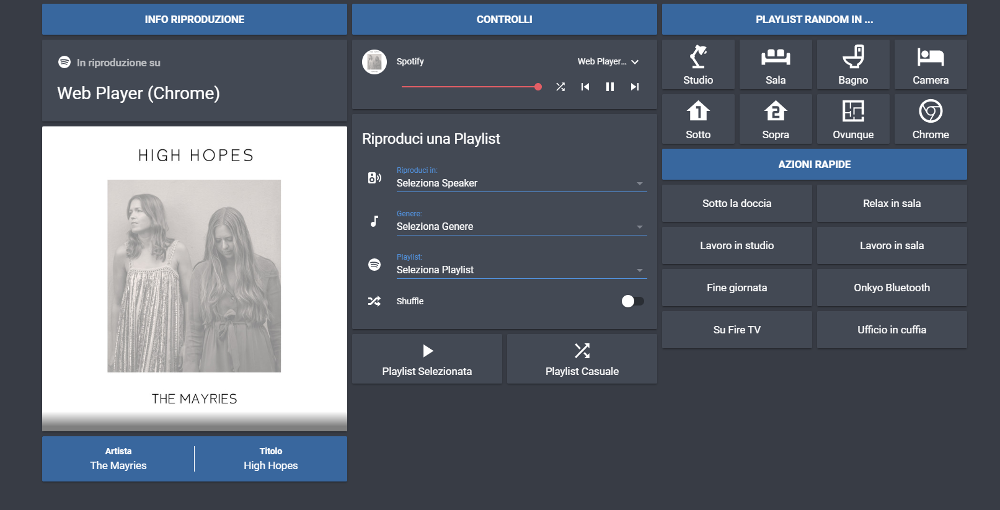
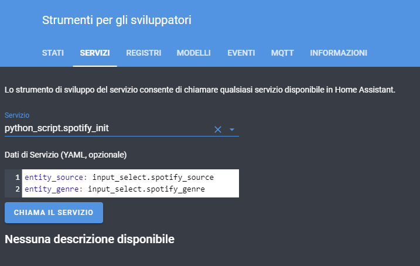

# ha-spotify-dynamic-console
Una console di Spotify su Home Assistant con playlist dinamiche.
Media player e playlist sono archiviate in un sensore custom e possono essere aggiunte/modificate senza la necessità di riavviare Home Assistant.



## Requisiti

  - Avere un abbonamento a Spotify Premium
  - Creare prima una [Spotify Application](https://www.home-assistant.io/integrations/spotify/)
  - Configurare il componente [python_script](https://www.home-assistant.io/components/python_script/)
  - Abilitare la gestione dei [packages](https://www.home-assistant.io/docs/configuration/packages/)
  
## Nota sui Media Player

Questo progetto necessita di dispositivi che siano SEMPRE disponibili su Spotify per la riproduzione.
Gli Amazon Echo ad esempio lo sono. I Google Home (con l'integrazione Google Cast) no purtroppo, hanno bisogno di essere prima attivati dall'app di Spotify.

Per risolvere il problema si può usare il custom component [Spotcast](https://github.com/fondberg/spotcast/), ma in questo progetto non è descritto il suo funzionamento.

## Installazione

  - Copiare gli script python nella propria directory **/config/python_scripts**
  - Copiare il package **spotify.yaml** nella propria directory **/config/packages**
  - Nel proprio file **secret.yaml** configurare le entry **spotify_client_id** e **spotify_client_secret**
  - Riavviare Home Assistant

## Configurazione

Le playlist Spotify e i propri dispositivi media player sono configurati come attributi in un sensore custom.
Questo consente agli script python di popolare dinamicamente le input select nella UI di lovelace e di aggiornare il proprio archivio di playlist senza la necessità di riavviare Home Assistant ogni volta.
Per applicare le modifiche alla configurazione è sufficiente lanciare lo script python_script.spotify_init indicando nei parametri i nomi delle proprie input select.



### Configurazione delle playlist

Aprire il file **spotify_init.py** nella directory **python_script** e modificare l'attributo **playlists** secondo il seguente tracciato:

```
genere#Nome Playlist#Spotify URI
```

Per trovare lo **Spotify URI** della playlist seguire [queste indicazioni](https://support.spotify.com/us/article/sharing-music/).

### Configurazione dei media player

Aprire il file **spotify_init.py** nella directory **python_script** e modificare l'attributo **sources** secondo il seguente tracciato:

```
Stanza#Nome dispositivo visualizzato su Spotify
```

Il nome del dispositivo Spotify deve essere **esattamente quello mostrato nell'app Spotify tra i dispositivi disponibili**, rispettando minuscole e maiuscole

## Utilizzo degli Script Python

Il progetto è composto da 3 script python:

### spotify_init 

Inizializza la console e viene eseguito allo start di Home Assistant (automazione nel package) o dopo aver modificato la configurazione.

Parametri:

  - **entity_source**: entity_id della input select dei dispositivi media player
  - **entity_genre**: entity_id della input select dei generi musicali
  
### spotify_load_playlist

Popola dinamicamente la lista delle playlist in base al genere selezionato dalla UI (automazione nel package)

Parametri:

  - **entity_playlist**: entity_id della input select delle playlist
  
### spotify_play

E' lo script che si occupa di far partire la riproduzione.

Parametri:

  - **source**: Stanza dove riprodurre la playlist (Obbligatorio)
  - **random**: Tipologia di riproduzione (Obbligatorio). Accetta 3 valori:
    - **no**: Avvia la playlist specificata nel parametro **playlist**
    - **genre**: Avvia la riproduzione di una playlist casuale in base al genere specificato nel parametro **genre**
    - **all**: Avvia la riproduzione di una playlist casuale tra tutte quelle configurate
  - **genre**: Obbligatorio nel caso di **random=genre**
  - **playlist**: Obbligatorio nel caso di **random=no**
  
## Esempi

Riproduzione delle ultime HITS durante la doccia

```yaml
- service: python_script.spotify_play
  data:
    source: 'Bagno'
    random: 'genre'
    genre: 'Hits'
```

Riproduzione di una playlist casuale in salotto

```yaml
- service: python_script.spotify_play
  data:
    source: 'Sala'
    random: 'all'    
```

Riproduzione di una playlist rilassante a fine giornata

```yaml
- service: python_script.spotify_play
  data:
    source: 'Sala'
    random: 'no'
    palylist: 'A Fine Giornata'
```

## View Lovelace

Ognuno può crearsi la propria view su Lovelace utilizzando card e componenti preferiti.
Di seguito un esempio di due vertical stack che utilizzano le seguenti card custom:

  - [Button Card](https://github.com/custom-cards/button-card/)
  - [Banner Card](https://github.com/nervetattoo/banner-card/)
  - [Mini Media Player](https://github.com/kalkih/mini-media-player/)
  
### Info Riproduzione

```yaml
- type: vertical-stack
cards:
  - name: Info Riproduzione
    template: header
    type: 'custom:button-card'
  - entity: sensor.spotify_source
    icon: 'mdi:spotify'
    name: In riproduzione su
    type: sensor
  - card:
      cards:
        - artwork: full-cover
          entity: media_player.spotify
          hide:
            controls: true
            icon: true
            info: true
            name: true
            power: true
            source: true
            volume: true
          type: 'custom:mini-media-player'
        - background: var(--primary-color)
          entities:
            - entity: sensor.spotify_artist
              name: Artista
            - entity: sensor.spotify_title
              name: Titolo
          heading: false
          row_size: 2
          type: 'custom:banner-card'
      type: vertical-stack
    conditions:
      - entity: media_player.spotify
        state_not: idle
    type: conditional
```  

### Controlli

```yaml
- type: vertical-stack
cards:
  - name: Controlli
    template: header
    type: 'custom:button-card'
  - entity: media_player.spotify
    hide:
      info: true
      power: true
      shuffle: false
    type: 'custom:mini-media-player'
  - entities:
      - entity: input_select.spotify_source
      - entity: input_select.spotify_genre
      - entity: input_select.spotify_playlist
      - entity: input_boolean.spotify_shuffle
    show_header_toggle: false
    title: Riproduci una Playlist
    type: entities
  - cards:
      - entity: script.spotify_play_playlist
        icon: 'mdi:play'
        name: Playlist Selezionata
        styles:
          card:
            - height: 80px
          name:
            - margin-top: 5px
        type: 'custom:button-card'
      - entity: script.spotify_play_random_playlist
        icon: 'mdi:shuffle'
        name: Playlist Casuale
        styles:
          card:
            - height: 80px
          name:
            - margin-top: 5px
        type: 'custom:button-card'
    type: horizontal-stack
```  
  
  
  

